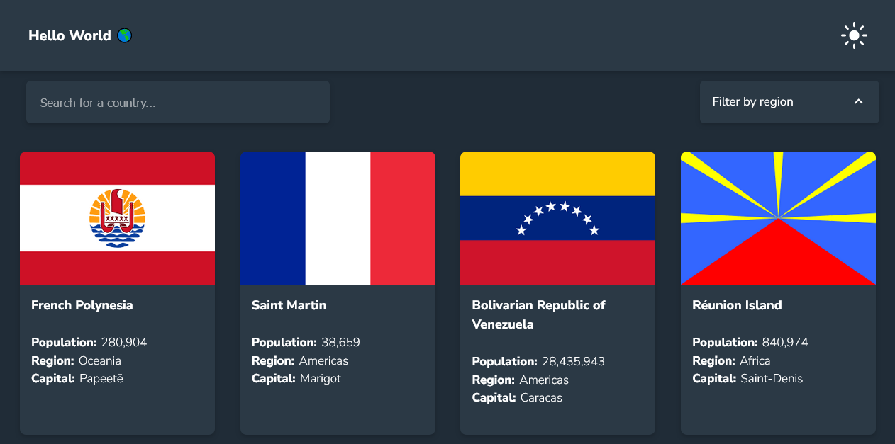

# Frontend Mentor - REST Countries API with color theme switcher solution

This is a solution to the [REST Countries API with color theme switcher challenge on Frontend Mentor](https://www.frontendmentor.io/challenges/rest-countries-api-with-color-theme-switcher-5cacc469fec04111f7b848ca). Frontend Mentor challenges help you improve your coding skills by building realistic projects.

## Table of contents

- [Overview](#overview)
  - [The challenge](#the-challenge)
  - [Screenshot](#screenshot)
  - [Links](#links)
- [My process](#my-process)
  - [Built with](#built-with)
  - [What I learned](#what-i-learned)
  - [Continued development](#continued-development)
  - [Useful resources](#useful-resources)
- [Author](#author)
- [Acknowledgments](#acknowledgments)

## Overview

### The challenge

Users should be able to:

- See all countries from the API on the homepage
- Search for a country using an `input` field
- Filter countries by region
- Click on a country to see more detailed information on a separate page
- Click through to the border countries on the detail page
- Toggle the color scheme between light and dark mode *(optional)*

**⚠️ NOTE ⚠️: Sometimes the REST Countries API can go down.**

### Screenshot

### Links

- [Source Code](https://github.com/ikennarichard/REST-Countries-API-with-color-theme-switcher)
- [Live Demo](https://timely-caramel-422843.netlify.app)

## My process

### Built with

- [React](https://reactjs.org/)
- [React Router](https://reactrouter.com/)
- [TanStack Query](https://tanstack.com/query/v4)
- [Styled Components](https://styled-components.com/)

### What I learned

`useState` helps with making our website or app look different when things change, while `useRef` helps us remember things without making any big changes.

### Continued development

- useContext
- Caching with TanStack Query
- Styled Components

### Useful resources

- Package Docs
- MDN Web docs
- Frontend mentor solutions

## Author

- Website - [Richy](https://ikennarichard.netlify.app)
- Frontend Mentor - [@ikennarichard](https://www.frontendmentor.io/profile/ikennarichard)
- Twitter - [@ikennarichard_](https://twitter.com/ikennarichard_)

## Acknowledgments

Big ups to this wonderful people for their unwavering support,

- [Microverse](https://www.microverse.org)
- [A](https://anselem-portfolio.netlify.app)
